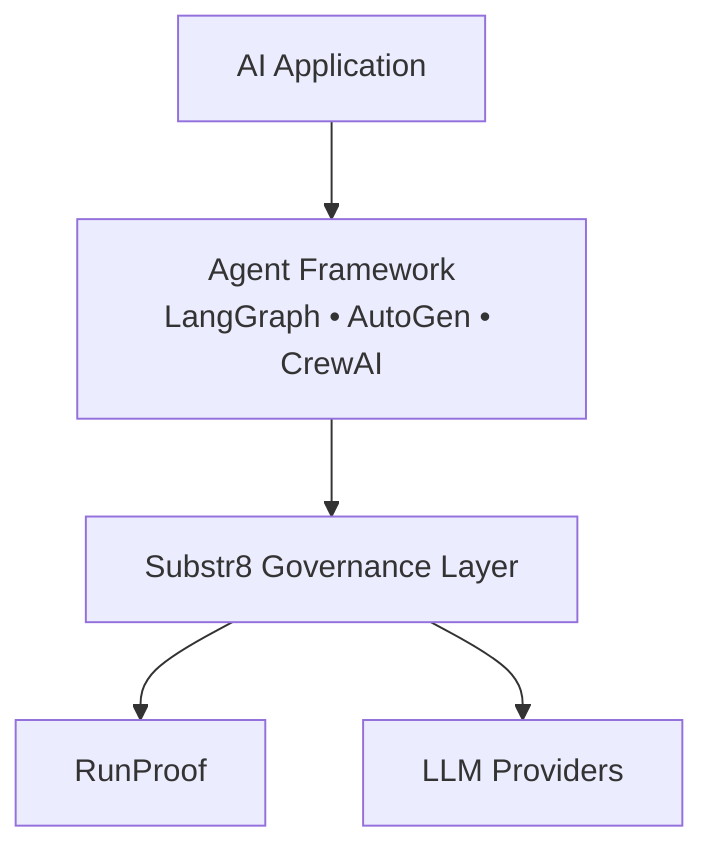
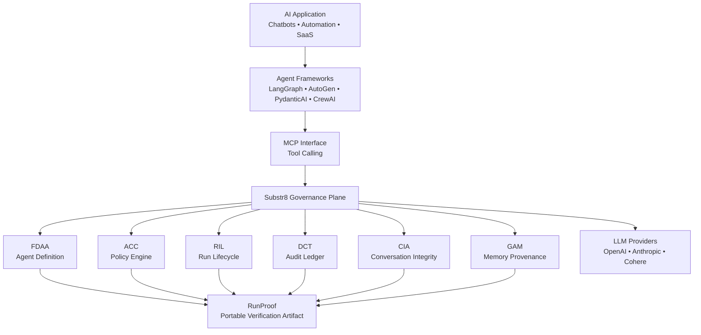

# Substr8

**Governance infrastructure for AI agents.**




> Substr8 is the **governance layer for AI agents**, producing **RunProof** — a portable artifact that proves what an agent did.

---

Substr8 adds **verifiability, auditability, and policy enforcement** to AI agents — without requiring changes to your framework.

Works with:

* LangGraph
* AutoGen
* PydanticAI
* CrewAI
* DSPy
* Custom agents

Any framework that supports **tool calling** can connect to Substr8 through **MCP**.

---

## Why Substr8

AI agents today have a fundamental trust problem.

When an agent says:

> "I searched the web and wrote the memory."

Did it actually? Did it follow policy? Did it modify memory? Did it call the right tools?

Most systems rely on **logs or dashboards**. Substr8 produces **cryptographic receipts** for every run.

Every governed run outputs a **RunProof** — a portable artifact that proves:

* which agent ran
* what it was allowed to do
* what actions occurred
* what memory was touched
* that the audit chain is intact

You can verify this **offline**.

---

## Quickstart (2 minutes)

Install the CLI:

```bash
pip install substr8
```

Initialize a project:

```bash
substr8 init my-agent
cd my-agent
```

This creates:

```
my-agent/
  examples/
    langgraph/
    autogen/
    pydantic-ai/
  runproofs/
  .env.example
  README.md
```

Run a governed agent:

```bash
substr8 run examples/langgraph/agent.py --local
```

Example output:

```
Substr8 Governance: ACTIVE

Run ID: run-6c39af

ACC policy loaded
CIA integrity checks enabled
DCT ledger initialized

Running agent...

Run completed ✓
RunProof generated: ./runproofs/run-6c39af.runproof.tgz
```

Verify the run:

```bash
substr8 verify runproofs/run-6c39af.runproof.tgz
```

Output:

```
RunProof Verified ✓

Run:     run-6c39af
Agent:   langgraph:researcher
Policy:  verified
Ledger:  chain valid
CIA receipts: present
Memory provenance: verified
```

---

## What is RunProof?

RunProof is a **portable verification artifact** produced for every governed run.

Think of it like:

| Technology   | Equivalent                     |
| ------------ | ------------------------------ |
| Docker       | container image                |
| SBOM         | software bill of materials     |
| Sigstore     | supply chain verification      |
| **RunProof** | **AI agent run verification**  |

A RunProof contains:

```
runproof/
  run.json
  agent/
    fdaa.manifest.json
  policy/
    acc.policy.json
  ledger/
    dct.ledger.jsonl
  cia/
    cia.receipts.jsonl
  memory/
    gam.pointers.jsonl
  RUNPROOF.sha256
```

You can verify it with:

```bash
substr8 verify <runproof.tgz>
```

No dashboard required.

---

## Architecture

Substr8 sits **between agent frameworks and model providers**.



Substr8 **does not replace frameworks**. It adds a **governance layer**.

---

## Zero-Friction Integration

Add Substr8 to any agent with **one wrapper**:

```python
from substr8 import govern

# Before
agent = create_react_agent(llm, tools)

# After
agent = govern(create_react_agent(llm, tools))
```

That's it. The wrapper automatically:

1. Starts a **run lifecycle**
2. Injects **policy checks**
3. Wraps **tool calls**
4. Emits **DCT ledger entries**
5. Records **CIA receipts**
6. Tracks **GAM memory operations**
7. Generates **RunProof on completion**

---

## Example: LangGraph Integration

```python
from substr8 import tool

@tool("web_search")
def web_search(query: str):
    ...
```

Run with Substr8 governance:

```bash
substr8 run agent.py
```

Every tool call will be:

* policy checked
* ledger recorded
* integrity verified
* included in RunProof

---

## Supported Frameworks

| Framework  | Status |
| ---------- | ------ |
| LangGraph  | ✅      |
| PydanticAI | ✅      |
| AutoGen    | ✅      |
| CrewAI     | ⚡      |
| DSPy       | ⚡      |

Any framework supporting **tool calling** can integrate via MCP.

---

## Local Development

Run everything locally:

```bash
substr8 mcp start --local
```

Local stack includes:

* MCP governance server
* audit ledger
* memory layer (optional)
* RunProof generation

---

## MCP Server

Connect Claude Desktop or any MCP client:

```json
{
  "mcpServers": {
    "substr8": {
      "url": "https://mcp.substr8labs.com",
      "headers": {
        "X-Substr8-Key": "your-api-key"
      }
    }
  }
}
```

Available tools:

| Category   | Tools                                           |
| ---------- | ----------------------------------------------- |
| Governance | `run.start`, `run.end`, `tool.invoke`, `policy.check` |
| Audit      | `audit.timeline`, `verify.run`                  |
| Memory     | `memory.write`, `memory.search`                 |
| CIA        | `cia.status`, `cia.report`, `cia.repairs`, `cia.receipts` |

---

## Substr8 Cloud (coming soon)

Connect to a hosted governance plane:

```bash
substr8 connect substr8.cloud
```

Cloud mode provides:

* hosted ledger
* hosted memory infrastructure
* RunProof storage
* verification dashboard
* policy management

---

## Why This Matters

AI agents are becoming responsible for:

* automation
* financial transactions
* customer interaction
* knowledge management

But today they operate largely on **trust**.

Substr8 replaces that with **verifiable infrastructure**.

---

## Core Philosophy

> AI agents should leave receipts.

Every action. Every policy decision. Every memory write.

**Provable.**

---

## The Category

Substr8 is **Agent Governance Infrastructure**.

| Tool      | Category                  |
| --------- | ------------------------- |
| Datadog   | observability             |
| Stripe    | payments infrastructure   |
| Docker    | container runtime         |
| **Substr8** | **agent governance**    |

> Frameworks build agents. Substr8 proves what they did.

---

## Roadmap

- [ ] RunProof signatures
- [ ] `verify.substr8labs.com` public verification
- [ ] ThreadHQ visualization
- [ ] Hosted governance plane
- [ ] Enterprise policy engine
- [ ] Compliance exports

---

## License

Copyright © 2026 Substr8 Labs.

Open protocol. Extensible infrastructure.
